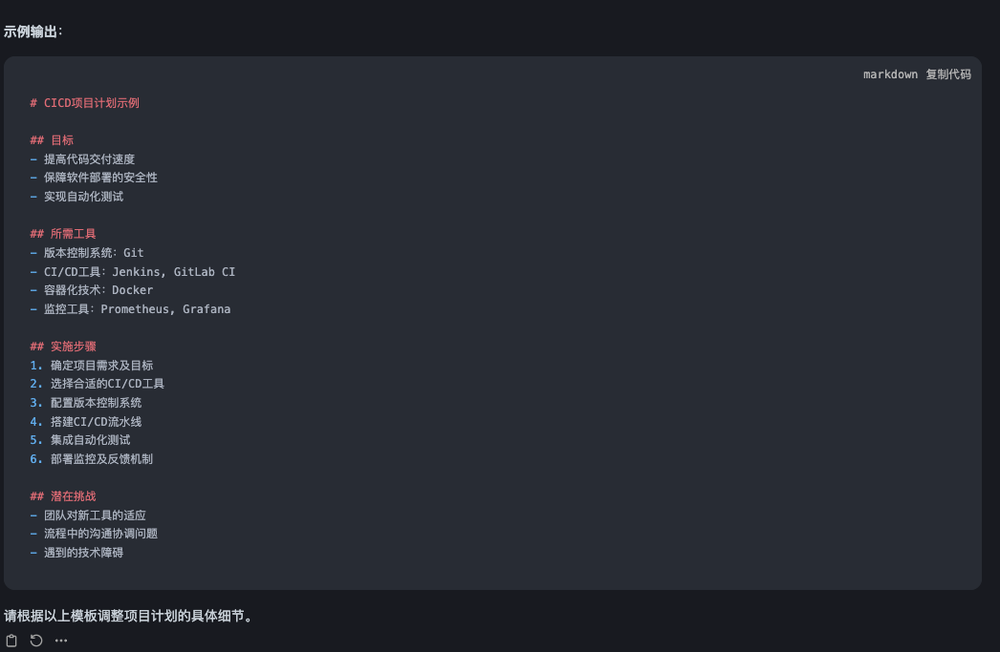
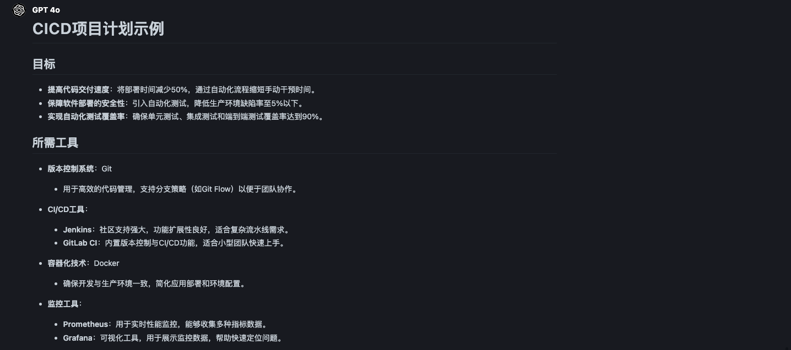
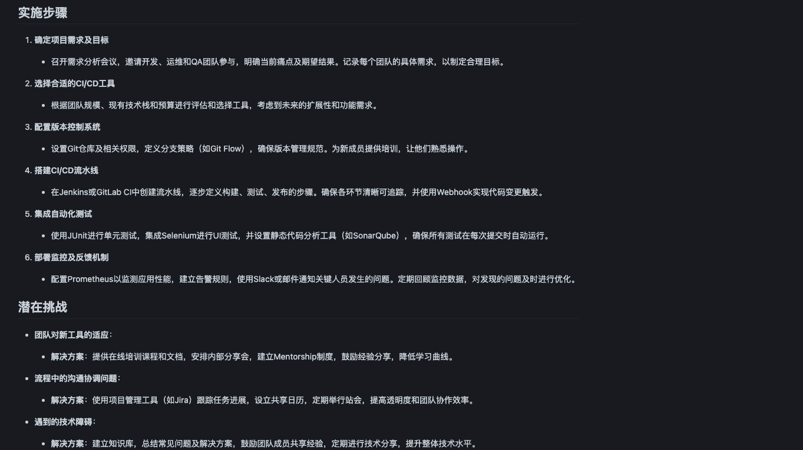

# 提示词：

# CICD项目计划示例

## 目标
- 提高代码交付速度，将部署时间减少50%
- 保障软件部署的安全性，通过自动化测试降低生产环境缺陷率
- 实现自动化测试覆盖率达到90%

## 所需工具
- **版本控制系统**：Git（用于代码管理，支持分支策略）
- **CI/CD工具**：Jenkins（社区支持强），GitLab CI（内置版本控制和CI/CD功能）
- **容器化技术**：Docker（实现一致的开发和生产环境）
- **监控工具**：Prometheus（实时监控），Grafana（可视化数据展示）

## 实施步骤
1. **确定项目需求及目标**
   - 召开需求分析会议，邀请开发、运维和QA团队参与，明确当前痛点及期望结果。
2. **选择合适的CI/CD工具**
   - 根据团队规模、现有技术栈和预算进行评估和选择工具，考虑到未来的扩展性。
3. **配置版本控制系统**
   - 设置Git仓库及相关权限，定义分支策略（如Git Flow），确保版本管理规范。
4. **搭建CI/CD流水线**
   - 在Jenkins中创建流水线，定义构建、测试、发布的步骤，确保各环节清晰可追踪。
5. **集成自动化测试**
   - 使用JUnit进行单元测试，集成Selenium进行UI测试，确保所有测试在每次提交时自动运行。
6. **部署监控及反馈机制**
   - 配置Prometheus以监测应用性能，使用Slack或邮件通知关键人员发生的问题。

## 潜在挑战
- **团队对新工具的适应**：
  - **解决方案**：提供在线培训课程和文档，安排内部分享会，建立Mentorship制度。
- **流程中的沟通协调问题**：
  - **解决方案**：使用项目管理工具（如Jira）跟踪任务进展，定期举行站会，提高透明度。
- **遇到的技术障碍**：
  - **解决方案**：建立知识库，总结常见问题及解决方案，鼓励团队成员共享经验。

## 时间预估与资源需求
- **整体项目周期**：约3个月
- **所需资源**：1名项目经理，2名开发人员，1名运维工程师，1名QA工程师

# 第一次大模型生成的提示词

# 最终大模型的回答

